# 旅游网(文末免费领取☟)
> 
#### 介绍
旅游网(Java_SpringBoot)
有BUG可留言加微

#### 软件架构
Java + SpringBoot + jpa + Mysql

#### 项目功能说明

1.  管理员功能
> + 用户管理
> + 酒店管理
> + 景点管理
> + 攻略管理
> + 路线管理
2.  用户功能
> + 登录注册
> + 首页：公告轮播、热门推荐
> + 旅游路线：旅游路线列表/关注、我关注的路线
> + 旅行攻略：旅行攻略、我发布的攻略、我关注的攻略
> + 在线预订：酒店预订、景点预订、我的预订
> + 用户中心

### 部分功能演示

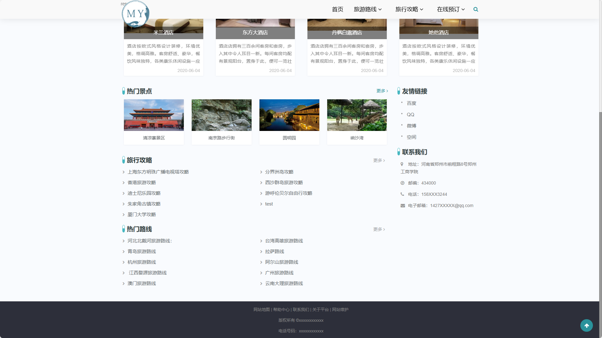
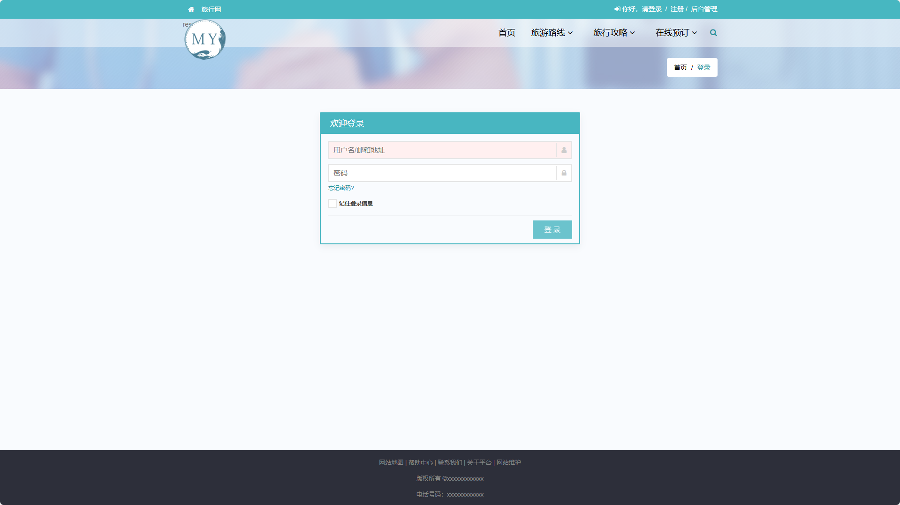
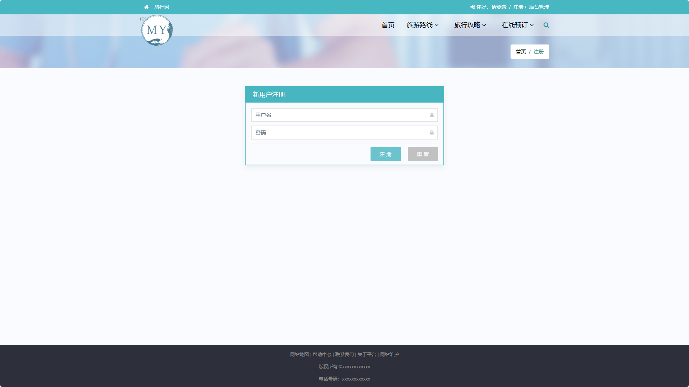
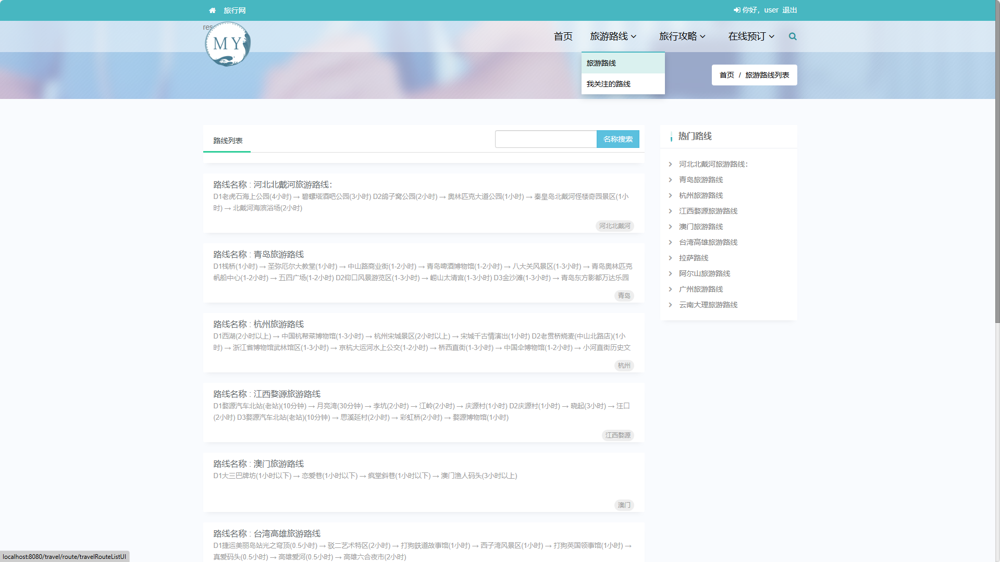
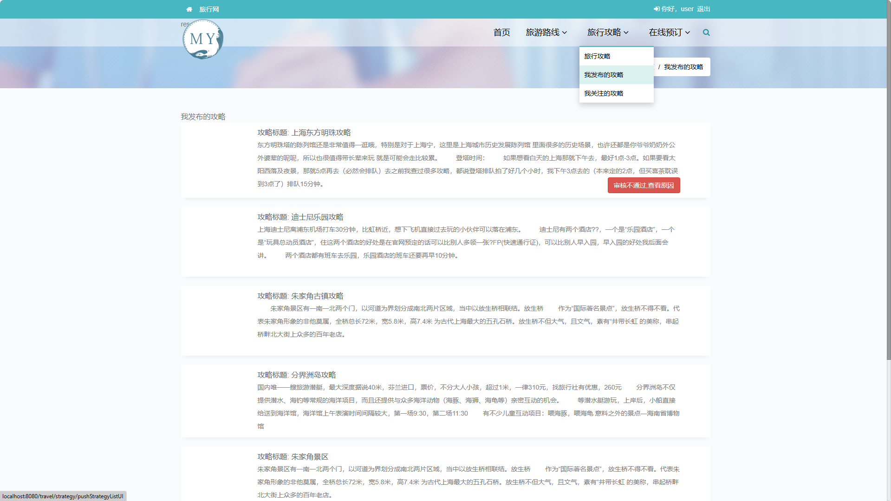
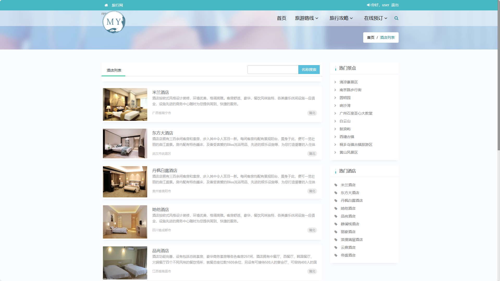
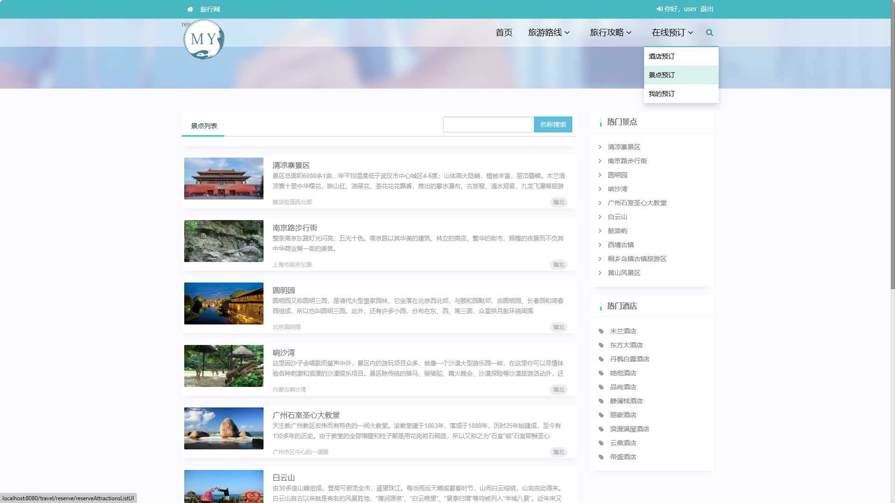

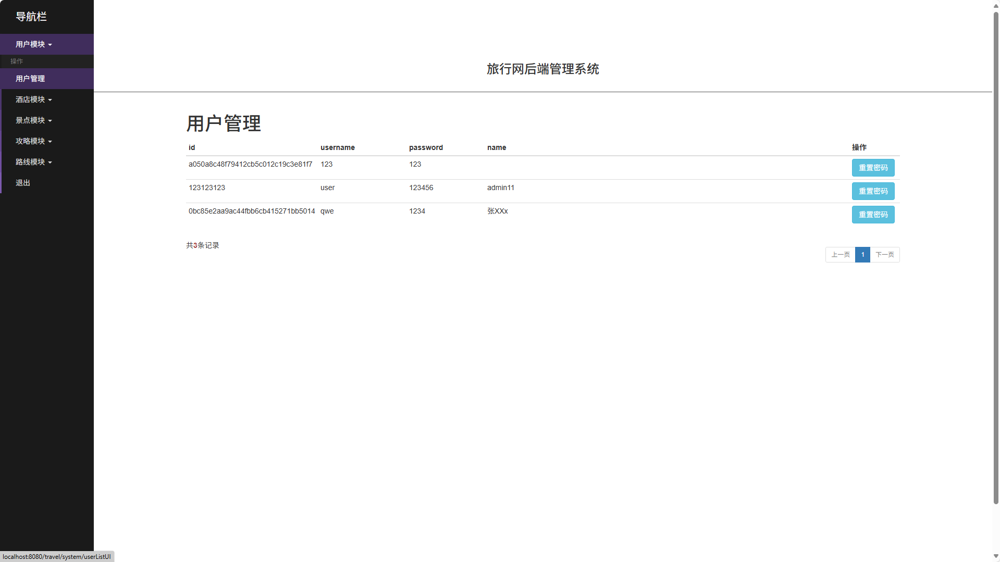
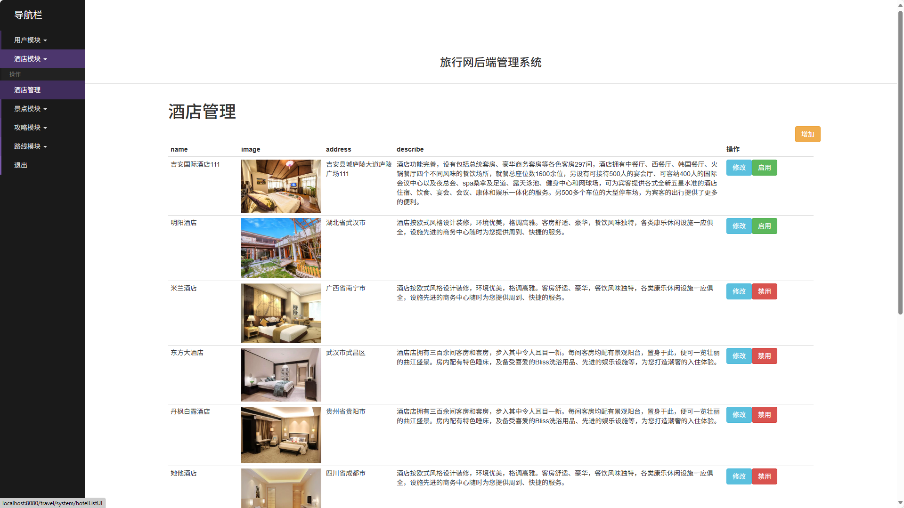
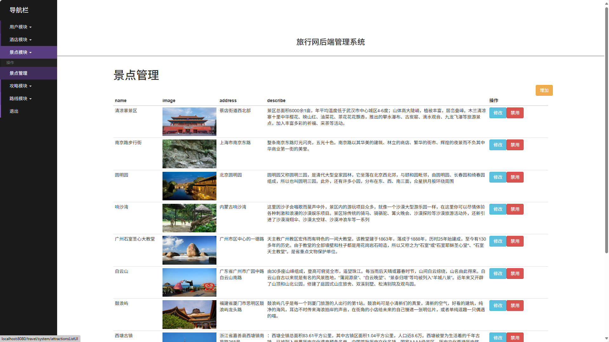
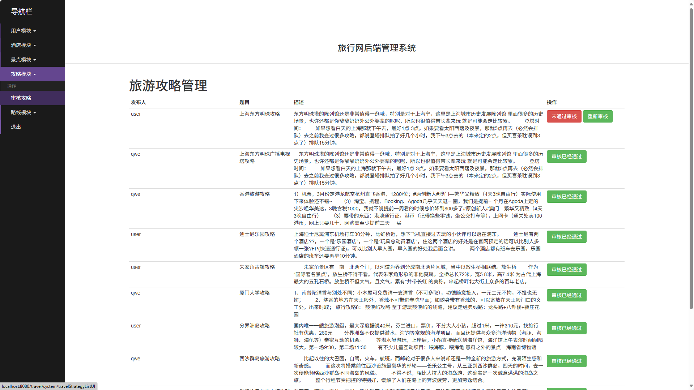
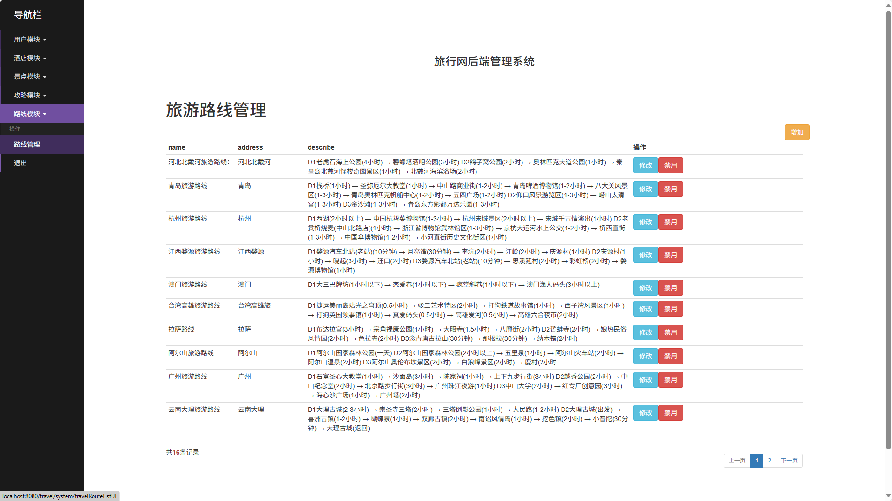

### 环境需求(可免费提供)
- idea/eclipse、jdk-1.8、maven-3.8.6、mysql、node.js等

## 有项目修改、安装调试需求 请联系以下

## 获取资源扫☝☝☝

